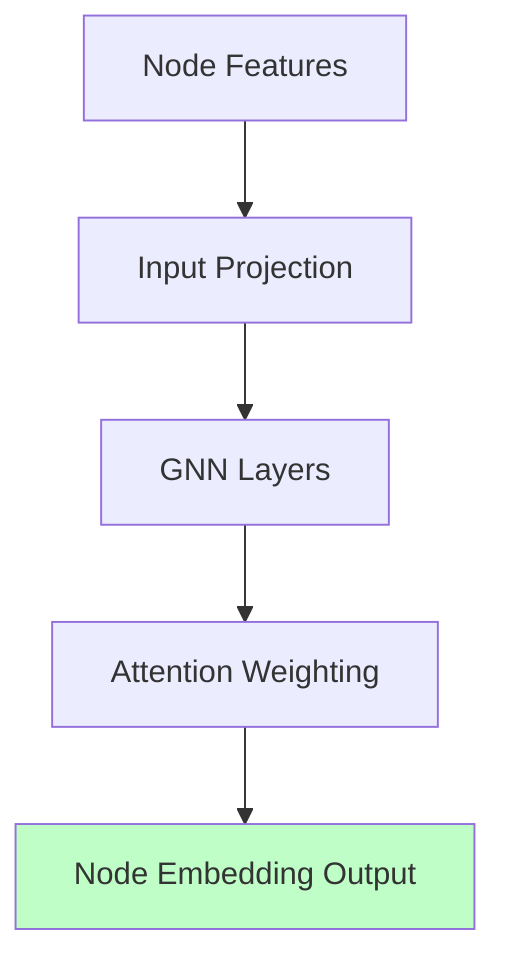
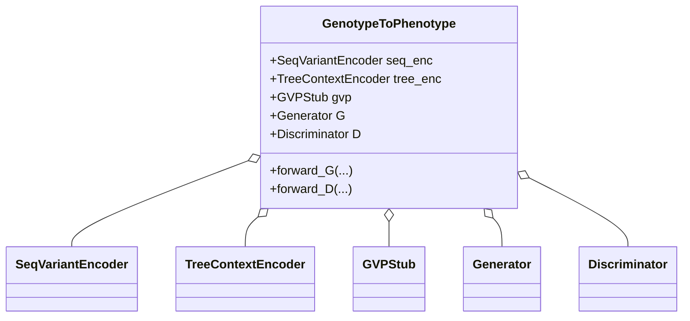
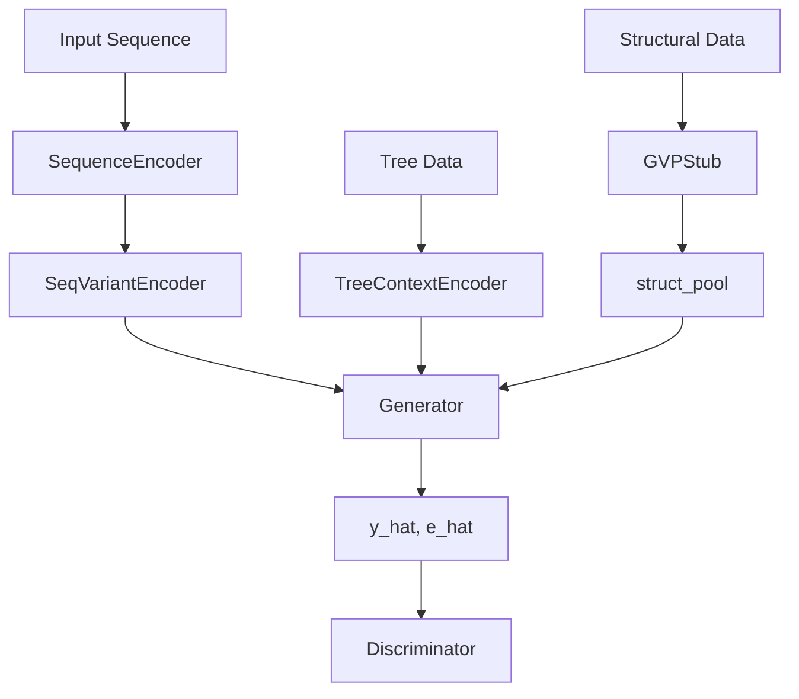

# Genotype-to-Phenotype Minimal Model Scaffold

This documentation covers two Python files: `g2p_model.py` and `run_toy.py`. Together, they provide a minimal, modular PyTorch framework for modeling sequence-to-function (genotype-to-phenotype) relationships. The design is tailored for advanced biological ML settings, allowing for the integration of sequence data, prior features, phylogenetic context, and even (optionally) structural data.

---

## g2p_model.py

This is the core library. It contains all neural network modules, utility functions, encoders, and loss definitions for the genotype-to-phenotype prediction task. The structure favors modularity and clarity, making it easy to extend for your own research.

### 🛠️ Utilities

These helper functions streamline the rest of the code and ensure flexible data handling.

- **mlp**: Constructs a configurable multilayer perceptron (MLP) with optional batch normalization and dropout.
- **to_device**: Recursively moves lists, dicts, numpy arrays, or tensors to the specified device (e.g., GPU).

```python
def mlp(sizes: List[int], act=nn.ReLU, dropout=0.0, bn=False) -> nn.Sequential:
    layers = []
    for i in range(len(sizes) - 1):
        layers.append(nn.Linear(sizes[i], sizes[i + 1]))
        if i < len(sizes) - 2:
            if bn:
                layers.append(nn.BatchNorm1d(sizes[i + 1]))
            layers.append(act())
        if dropout > 0:
            layers.append(nn.Dropout(dropout))
    return nn.Sequential(*layers)
```

---

### Sequence Encoding

Handles one-hot and embedding representations for DNA or protein sequences.

- **DNA_ALPHABET**: `"ACGTN"`
- **PROT_ALPHABET**: `"ACDEFGHIKLMNPQRSTVWYX"`
- **SequenceEncoder**: Encodes biological sequences into one-hot or index representations.

#### Example: One-hot Encoding

```python
enc = SequenceEncoder(kind="protein")
seq = "MKTFFVLLL"
onehot = enc.one_hot(seq)
```

**Purpose:** Converts a biological sequence into a tensor suitable for neural networks.

---

### Building Prior Feature Tensors

The function `build_prior_tensor` concatenates feature matrices (such as those from TreeSAAP or PolyPhen) into a single tensor per sequence position.

```python
def build_prior_tensor(length: int, treesaap_props: Optional[np.ndarray] = None, polyphen_scores: Optional[np.ndarray] = None) -> torch.Tensor:
    ...
```

---

### Phylogenetic Tree Encoder

#### Class: `TreeContextEncoder`

A lightweight graph neural network (GNN) for encoding phylogenetic information. Nodes represent taxa; edges encode evolutionary relationships.

- **Inputs:**  
    - Node features `[N, F]`
    - Edge indices `[2, E]`
    - Edge lengths `[E]`
- **Outputs:**
    - Node embeddings `[N, H]`

```python
class TreeContextEncoder(nn.Module):
    ...
```

#### Diagram: Data Flow in TreeContextEncoder



---

### Structural Context Encoder (Optional)

#### Class: `GVPStub`

A minimal stub for Geometric Vector Perceptron (GVP)-style processing of structural (3D) features. Used if `use_structure=True`.

- **Inputs:** Scalar and vector node features, edge indices.
- **Output:** Node embeddings concatenating scalar and vector parts.

---

### Sequence + Prior Encoder

#### Class: `SeqVariantEncoder`

Combines sequence one-hot and prior features using a 1D convolutional neural network.

- **Inputs:**  
    - Sequence one-hot `[L, A]`
    - Priors `[L, P]`
- **Output:**  
    - Encoded feature `[out_dim]`

---

### Generator & Discriminator (GAN Framework)

#### Generator

- **Inputs:**  
    - Sequence embedding
    - Tree embedding
    - (Optional) Structural embedding
- **Outputs:**  
    - Predicted phenotype (`y_hat`)
    - Global effect score (`e_hat`)

#### Discriminator

- **Inputs:**  
    - Sequence embedding
    - Tree embedding
    - Observed phenotype
- **Output:**  
    - Real/fake scalar score

---

### Losses

- **supervised_loss**: Supports regression (MSE) or classification (cross-entropy).
- **gan_losses**: Implements several GAN loss regimes (LSGAN, hinge, vanilla).
- **phylo_contrastive**: Contrastive loss on phenotype predictions, weighted by phylogenetic similarity.

---

### Full Model Wrapper

#### Class: `GenotypeToPhenotype`

This class ties together all encoders, the generator, and the discriminator.



---

### Training Loop

#### Function: `train_one_epoch`

Runs a single epoch of GAN training, combining supervised, adversarial, and phylogenetic contrastive losses.

**Training Steps:**
- For each batch:
    - Encode all data (sequence, priors, tree, structure).
    - Forward pass through generator and discriminator.
    - Compute losses.
    - Backpropagate and update both generator and discriminator.

#### GAN Training Loop Flow

```mermaid
flowchart TD
    A[Batch Loader] --> B[Sequence & Tree Encoding]
    B --> C[Generator (y_hat, e_hat)]
    C --> D[Discriminator]
    D --> E[Compute Losses]
    E --> F[Update Discriminator]
    E --> G[Update Generator]
```

---

## run_toy.py

This script demonstrates a **toy forward pass** using `GenotypeToPhenotype`. It does NOT train the model, but simply runs data through all encoders and the generator.

### Main Steps

1. **Sequence & Priors Setup:**
    - Encodes a dummy protein sequence (`"MKTFFVLLL"`)
    - Generates random prior features (like TreeSAAP and PolyPhen outputs)

2. **Phylogenetic Tree Setup:**
    - Sets up a trivial tree of 3 nodes (tips) in a chain
    - Uses zeroed node features for simplicity

3. **Model Construction:**
    - Instantiates `GenotypeToPhenotype` with the dummy data dimensions
    - Disables structural features

4. **Forward Pass:**
    - Runs a sample through the full model (`forward_G`)
    - Prints out the shapes and sample outputs

#### Example Output

```
OK — forward pass completed.
seq_emb shape: (256,)
tree_emb shape: (256,)
y_hat shape: (1,) value: -0.085
effect score (toy): 0.045
```

---

## Key Architectural Relationships

### Overall Module Data Flow



---

## 📝 Notable Features & Best Practices

- **Highly Modular:** Each encoder and network block is a separate, reusable class.
- **Flexible Input:** Supports sequence, prior, phylogenetic, and optional structural information.
- **GAN Framework:** Allows adversarial training for more robust prediction.
- **Phylogenetic Contrast:** Incorporates evolutionary context into learning, improving biological realism.
- **Device Agnostic:** All tensor operations support `.to(device)`, making GPU/CPU switching trivial.

```card
{
    "title": "Extension-Ready",
    "content": "The architecture makes it easy to add new input modalities or swap out encoders with more complex variants."
}
```

---

## When to Use This Scaffold

- Prototyping new genotype-to-phenotype ML architectures.
- Testing the impact of evolutionary or structural features.
- Exploring GANs and contrastive learning in biological settings.
- Educational purposes or as a starting point for research projects.

---

## Limitations

- The structure encoder (`GVPStub`) is a minimal placeholder, not a full geometric deep learning block.
- Training loop is simplified; for real applications, add logging, validation, and checkpointing.
- No data loaders or real datasets included—users must provide batches in the correct format.

---

## Summary Table

| Module/Class              | Purpose                                             | Input Shape(s)          | Output Shape         |
|---------------------------|-----------------------------------------------------|-------------------------|----------------------|
| `SequenceEncoder`         | Encodes sequences (DNA/protein)                     | `[L]`                   | `[L, A]` (one-hot)   |
| `SeqVariantEncoder`       | Merges sequence/prior features                      | `[L, A], [L, P]`        | `[out_dim]`          |
| `TreeContextEncoder`      | Encodes phylogenetic tree context                   | `[N, F], [2, E], [E]`   | `[N, H]`             |
| `GVPStub` (optional)      | Placeholder for geometric features                  | `[N, S], [N, V]`        | `[N, S+V]`           |
| `Generator`               | Predicts phenotype and effect score                 | `[E_s], [E_t], [E_p]`   | `[Y], [1]`           |
| `Discriminator`           | Judges real/fake on inputs                          | `[E_s], [E_t], [Y]`     | `[1]`                |
| `GenotypeToPhenotype`     | Full model wrapper/composition                      | see above               | see above            |

---

## Final Notes

This framework is a powerful starting point for anyone working on sequence-to-function prediction with advanced biological context. Its modularity, clear API, and extensibility make it easy to adapt to your own research needs.

---

### 🧬 Happy modeling!